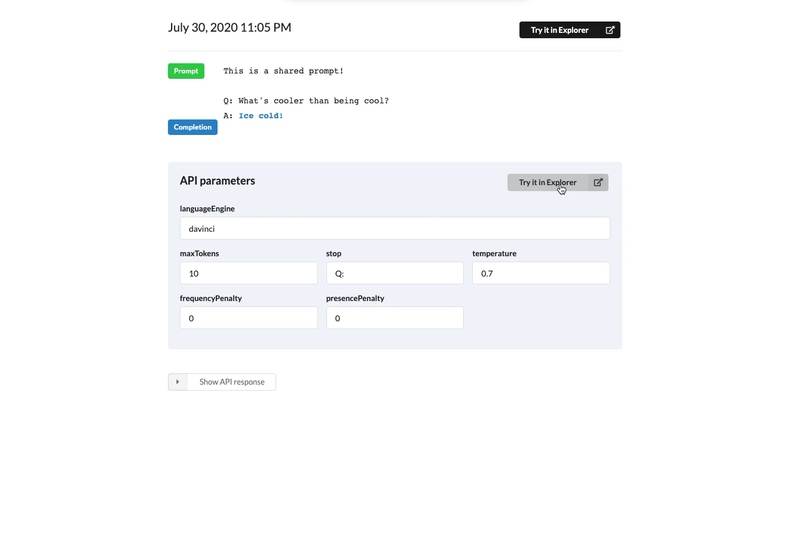

<div align="center">
  <h1 href="http://gpt-3-explorer.vercel.app/">GPT-3 Explorer</h1>
  <p>
    <strong>A power tool for experimenting with GPT-3</strong>
  </p>
  <br />
</div>


<strong>[Go to Explorer 🚀](http://gpt-3-explorer.vercel.app/)</strong>

Explorer is a power tool for iterating on GPT-3 prompts and settings. Bring your own [API key](https://beta.openai.com/).

Don't have access yet? Check out some awesome completions from our community 🤗:\


## Features

**Dashboard for interacting with [GPT-3 API](https://beta.openai.com/api-ref)**\
A simple intuitive GUI for making GPT-3 API completion requests and iterating on prompts
<table><tr><td>

</td></tr></table>


**Prompt and completion history**\
Pull up past completion prompt and settings to rerun, review notes, and share.
<table><tr><td>

</td></tr></table>

**Shareable prompts and settings [(example)](https://gpt-3-explorer.vercel.app/p/R5WLwJTNWcCP7b0xwvEM)**\
Share completions with collaborators and the world. Have them try out the settings in their own Explorer account.
<table><tr><td>

</td></tr></table>


🐥Have a feature request? Submit it [here](https://github.com/belay-labs/gpt-explorer/issues/new?labels=feature-request&template=feature_request.md).


## Hosted version

**Explorer is deployed here: http://gpt-3-explorer.vercel.app/**

Your data is securely stored in Firebase behind Google OAuth. Explorer does not own your data - we do not use or sell it to third-parties. Read more in our [privacy policy](https://www.notion.so/belay/GPT-3-Explorer-Data-Privacy-cc78082a1d994b7ab8d37df0039a5017).


## Contributing

**[🐛Submit a bug](https://github.com/belay-labs/gpt-explorer/issues/new?labels=bug&template=bug_report.md)** | **[🐥Submit a feature request](https://github.com/belay-labs/gpt-explorer/issues/new?labels=feature-request&template=feature_request.md)**


#### Developing
This is a [Next.js](https://nextjs.org/) project bootstrapped with [`create-next-app`](https://github.com/vercel/next.js/tree/canary/packages/create-next-app).

**Install all dependencies**
```
yarn install
```

**Create file for local environment variables**
In the project root create a `.env.local` file with your test Firebase credentials.
```
NEXT_PUBLIC_FIREBASE_APIKEY=
NEXT_PUBLIC_FIREBASE_AUTHDOMAIN=
NEXT_PUBLIC_FIREBASE_DATABASEURL=
NEXT_PUBLIC_FIREBASE_PROJECTID=
NEXT_PUBLIC_FIREBASE_APPID=
```

**Run development server**
```
yarn dev
```


#### Review & deployment
 
Create a PR describing the change you've made and someone will be along to review it and get it merged to master. After changes are merged to `master`, we'll trigger a production deployment to http://gpt-3-explorer.vercel.app/.


## Roadmap

This tool was built to unblock our own experimentation and product research with GPT-3. As our own experimentation process develops, we'll continue to add features to Explorer so we can augment our own explorations, and hopefully the rest of the community's.

Check out our [public roadmap](https://github.com/belay-labs/gpt-explorer/projects) to see what's upcoming for Explorer!


## Discussion
**[OpenAI Slack](https://openai-api.slack.com/archives/C01763GPGTC/p1596216349338600)**


## Maintainers
Hi! We're [Cathy](https://github.com/cathykc), [Stedman](https://github.com/stedmanblake), and [Zain](https://github.com/tarzain). We initially built this as a small internal tool and thought it'd be useful to others as they explore GPT-3 usecases. Feel free to DM us in the OpenAI Slack or email us at cathy@belaylabs.com! 👋

#### Resources we love
**[📜gpt-scrolls](https://github.com/maraoz/gpt-scrolls)**\
**[📖gptprompts.wikidot.com](http://gptprompts.wikidot.com/)**


## License
[](https://opensource.org/licenses/Apache-2.0)


This project is licensed under the terms of the [Apache-2.0](LICENSE).
