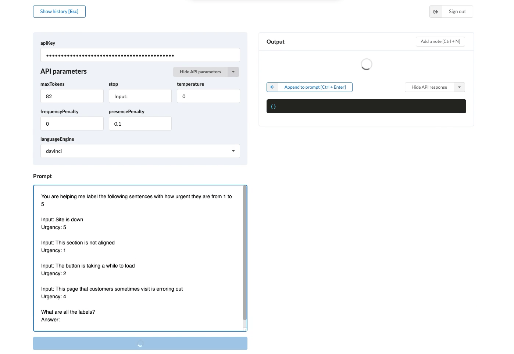

# Introducing GPT Explorer

Explorer is a power tool for GPT-3 experimentation with **full history**, **sharing**, and the community's **best-practices** built-in. If you're just getting started with GPT-3 or don't want to build out your own boilerplate codebase, try the hosted version: [Explorer](https://gpt-3-explorer.vercel.app). The source is available [here](https://github.com/belay-labs/gpt-explorer).

 

## A UI for experimentation

To get good results from GPT-3, you need to experiment. (Despite what the cherry-picked examples on Twitter will have you believe!)

This fundamental insight led to Explorer's first feature: saved history. They say the difference between tinkering and science is rigor and reproducibility. We codified that transition by making all our prompts and settings automatically saved and shareable. Annotations further allowed us to build and improve upon previous results.

Long term, we envision an environment that enables the development of higher level APIs on top of GPT-3. A system for designing pipelines of prompts, complex scripts, logic to retrieve external information — that can all be published for use in products and research.

Building complex applications requires you to work at a higher level of abstraction than machine code. **How can we build an open source operating system for GPT-3 at the dawn of [Software 2.0](https://medium.com/@karpathy/software-2-0-a64152b37c35)?**

## Get involved!

There's a long road ahead and we're thankful for all of your feedback and suggestions so far. We welcome code contributions to Explorer - pop over to [the repository](https://github.com/belay-labs/gpt-explorer) to learn how you can get it running locally!

Oh, and try it out [here](https://gpt-3-explorer.vercel.app) :)

– Cathy, Stedman, & Zain
 
 
 

---

## Appendix

### Building together

The community is continually discovering incredible methods for unlocking GPT-3's potential. Without the right set of tools, most practitioners struggle to find and implement these new techniques.

That's where we see the need for an open source project where we can all rapidly experiment and codify what we've learned. Here are some of the community's methods and best practices that we're excited to incorporate as features in Explorer:

**Prompt chaining**

- This method skirts the token limit by "chaining" together prompts and their outputs.
- [Chaining](http://gptprompts.wikidot.com/chaining:chaining) breaks down larger tasks into component sub-tasks, before composing them back together in a single prompt to get your final result.

**Context stuffing**

This is a method of iterative prompt improvement that involves:

1. Running an initial prompt
2. Cherrypicking the best GPT-3 outputs,
3. Appending them to the original prompt, to provide more examples for GPT-3 to use.

 
### The Roadmap

In the coming months, with your help, we plan to build these features (and more!). As the private beta comes to an end, let's enable new GPT-3 users to hit the ground running with the cumulative, collective insights of the community.

As we receive feedback and contributions from the community, this roadmap will continue to change and be reprioritized. You can follow a live version of it [here](https://github.com/belay-labs/gpt-explorer/projects/1).

**Sharing and importing prompts**

- "GitHub for Prompts". Let's make it easy to share and build on each others' work!

**Prompt evaluation**

- GPT's performance is very, very sensitive to prompt design. So iterating on prompt design is our highest priority.
- With built-in tools for prompt evaluation, you can annotate, rank and sort results for the same task across different prompt designs.

**Scripting & chaining**

- Enable commands which can trigger scripts.
- These scripts can then: *i.* do computation, or *ii.* trigger API requests to do actions, get more information, call other prompts, etc.
- In particular, this scripting interface can chain prompts together.

**Higher level API interface**

- The OpenAI API is all about simplicity, it is a raw text-in, text-out interface, which is great to build on top of but does not make it easy to best take advantage of the tool.
- We envision a higher level API which you can use to develop higher-level reasoning and operations on top of the low level API. Turn any prompt, which itself can be a pipeline of other prompts, into an API.
- This enables a more broadly useful natural language interface for: chat, question answering, text transformations, multi-step labeling, and other pipelines of natural language operations

 

Try [Explorer](https://gpt-3-explorer.vercel.app).
Contribute to the [open source project](https://github.com/belay-labs/gpt-explorer).
